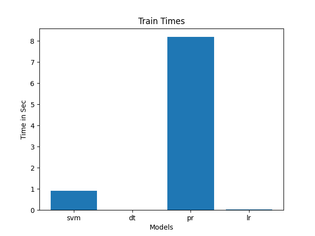
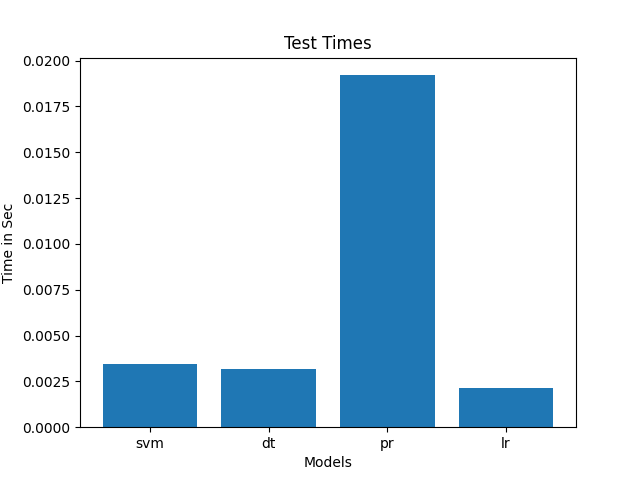
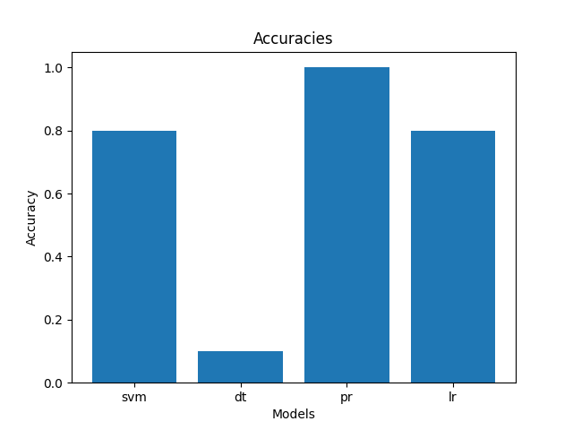

# Phase 2 Documents

## Classification Result

## Hyper Params of SVM

| C   | Kernel | Accuracy | Reason                                     |
|-----|--------|----------|--------------------------------------------|
| 1   | Linear | -        | Long time to train                         |
| 1   | poly   | 0        | -                                          |
| 1   | RPF    | 0.8      | Medium sample size and Small feature count |
| 0.5 | -      | 0.8      | No change due to small test sample         |

## Conclusion
Applying our basic preprocessing techniques from phase 1 was not enough for this phase. As we have
discovered that these techniques were broken and need alot of modificataion. So, we rebuild these
techniques from scratch.

### What was wrong in the previous preprocessing techniques

- Dropping non-essintial columns insteed of making they all zeros.
- Starting the models without making sure that train and test data have the save columns.